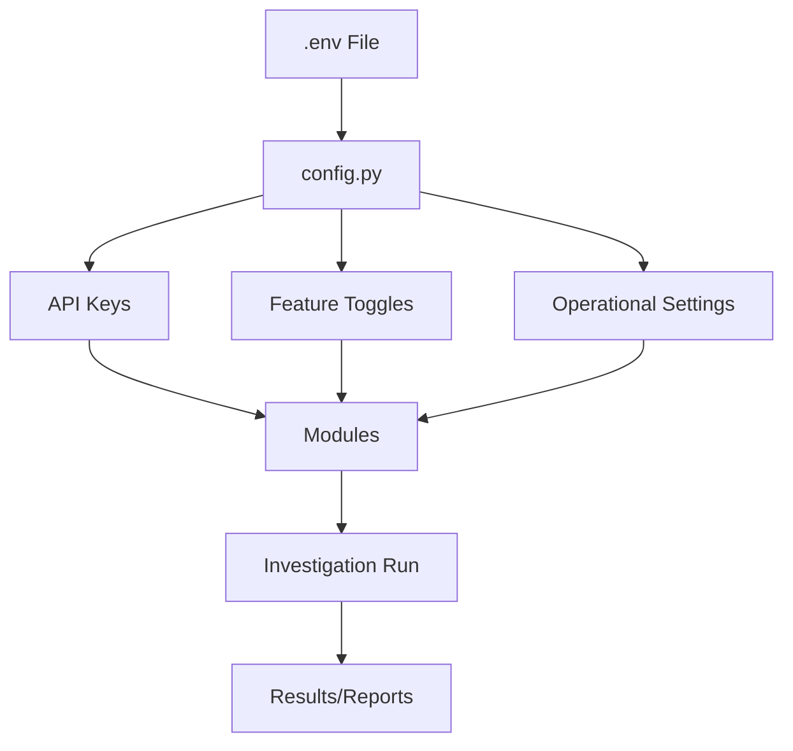
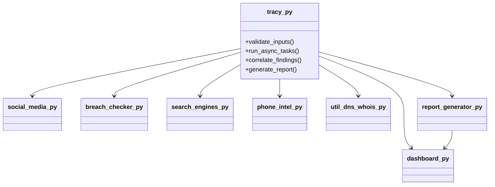
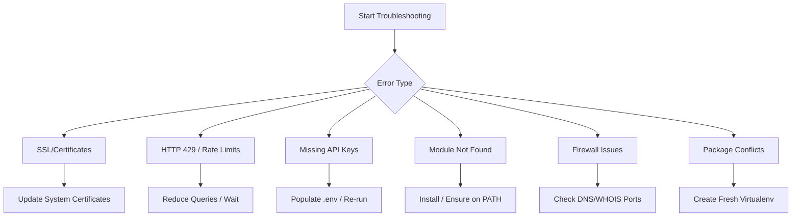
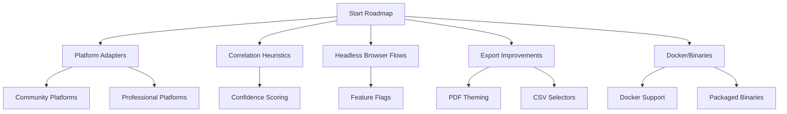

<p align="center">
  
</p>

<h1 align="center">Tracy — Digital Footprint OSINT Tool</h1>

<p align="center">
  <a href="https://github.com/Xenonesis/tracy.git"></a>
  <a href="https://github.com/Xenonesis/tracy/actions"></a>
  <a href="https://github.com/Xenonesis/tracy/blob/main/LICENSE.md"></a>
  
  
</p>

> **Repository:** [https://github.com/Xenonesis/tracy.git](https://github.com/Xenonesis/tracy.git)

---

Tracy is a modern Open Source Intelligence (OSINT) orchestrator that maps a target’s digital footprint starting from an email and/or phone number. It runs concurrent, privacy‑respecting checks across social platforms, breach sources, search engines, DNS/WHOIS, and reputation/verification services, correlates signals, and generates reports and an interactive dashboard.

---

**Key goals** 🚀  
- Safe defaults using only publicly available information, with optional API integrations  
- Async-first architecture for fast concurrent investigations  
- Clean output artifacts (JSON + HTML/Markdown/Text reports) and a visual dashboard  


## ✨ Highlights

| Feature | Description |
|---------|-------------|
| 📧 Email & 📱 Phone Inputs | Investigate digital footprint from email/phone |
| ⚡ Concurrent OSINT Modules | Social media, breach intelligence, search engine dorking, phone intel, DNS/WHOIS, reputation/verification, presence checks |
| 🔗 Actionable Links | Direct links to profiles, breaches, and search results |
| 🧠 Correlation Engine | Summarizes cross-signal insights |
| 📝 Report Generator | Outputs in HTML, Markdown, Text, JSON |
| 📊 Interactive Dashboard | Explore results visually (Dash/Plotly) |

---

<details>
  <summary><strong>⚡ Installation (click to expand)</strong></summary>

> **Tip:** Use a virtual environment for best results.

**Prerequisites:**
- Python 3.10+ recommended
- pip and virtualenv (optional but recommended)
- On Windows, ensure build tools are available for any packages that may require them

**1) Clone and setup environment**
```sh
git clone https://github.com/your-org/tracy.git
cd tracy
python -m venv .venv
.venv\Scripts\activate  # Windows
# source .venv/bin/activate  # macOS/Linux
```

**2) Install dependencies**
```sh
pip install --upgrade pip
pip install -r requirements.txt
```

**3) Configure environment**
- Copy .env.example to .env and fill the keys you want to enable
```sh
cp .env.example .env
```

_Minimum usage does not require any API keys, but some integrations will be no-ops without them._
</details>

---

<details>
  <summary><strong>⚙️ Configuration (click to expand)</strong></summary>



| Variable                | Type      | Purpose                                      | Example Value                |
|-------------------------|-----------|----------------------------------------------|------------------------------|
| SHODAN_API_KEY          | API Key   | Enables Shodan integration                   | `your_shodan_api_key_here`   |
| TWITTER_BEARER_TOKEN    | API Key   | Enables Twitter integration                  | `your_twitter_token_here`    |
| HAVEIBEENPWNED_API_KEY  | API Key   | Enables HIBP breach checks                   | `your_hibp_api_key_here`     |
| DEHASHED_API_KEY        | API Key   | Enables DeHashed breach checks               | `your_dehashed_api_key_here` |
| DEHASHED_USERNAME       | Username  | Used for DeHashed authentication             | `your_dehashed_username`     |
| EMAILREP_API_KEY        | API Key   | Enables EmailRep reputation checks           | `your_emailrep_api_key_here` |
| HUNTER_API_KEY          | API Key   | Enables Hunter email verification            | `your_hunter_api_key_here`   |
| ENABLE_EMAILREP         | Toggle    | Enable/disable EmailRep module               | `true` / `false`             |
| ENABLE_HIBP             | Toggle    | Enable/disable HIBP module                   | `true` / `false`             |
| ENABLE_HUNTER           | Toggle    | Enable/disable Hunter module                 | `true` / `false`             |
| ENABLE_SOCIALSCAN       | Toggle    | Enable/disable SocialScan module             | `true` / `false`             |
| ENABLE_DNS_WHOIS        | Toggle    | Enable/disable DNS/WHOIS module              | `true` / `false`             |
| ENABLE_SHERLOCK         | Toggle    | Enable/disable Sherlock module               | `true` / `false`             |
| REQUEST_TIMEOUT         | Setting   | Timeout for requests (seconds)               | `30`                         |
| RATE_LIMIT_DELAY        | Setting   | Delay between requests (seconds)             | `1`                          |
| MAX_RESULTS_PER_PLATFORM| Setting   | Max results per platform                     | `50`                         |
| DASH_HOST               | Setting   | Dashboard host address                       | `127.0.0.1`                  |
| DASH_PORT               | Setting   | Dashboard port                               | `8050`                       |
| DASH_DEBUG              | Setting   | Dashboard debug mode                         | `true` / `false`             |

<details>
  <summary><strong>ASCII Configuration Flow (click to expand)</strong></summary>

```
+-------------------+
|      .env File    |
+-------------------+
         |
         v
+-------------------+
|    config.py      |
+-------------------+
         |
         v
+-------------------+    +-------------------+    +-------------------+
|   API Keys        |    | Feature Toggles   |    | Operational Set.  |
+-------------------+    +-------------------+    +-------------------+
         |                |                     |
         v                v                     v
+------------------------------------------------+
|                Modules                         |
+------------------------------------------------+
         |
         v
+-------------------+
| Investigation Run |
+-------------------+
         |
         v
+-------------------+
| Results/Reports   |
+-------------------+
```
</details>

---

**Environment variables (.env) read by config.py:**

**API keys (optional):**
- SHODAN_API_KEY
- TWITTER_BEARER_TOKEN
- HAVEIBEENPWNED_API_KEY
- DEHASHED_API_KEY
- DEHASHED_USERNAME
- EMAILREP_API_KEY
- HUNTER_API_KEY

**Feature toggles (defaults to true if missing):**
- ENABLE_EMAILREP
- ENABLE_HIBP
- ENABLE_HUNTER
- ENABLE_SOCIALSCAN
- ENABLE_DNS_WHOIS
- ENABLE_SHERLOCK

**Operational settings:**
- REQUEST_TIMEOUT (default 30)
- RATE_LIMIT_DELAY (default 1)
- MAX_RESULTS_PER_PLATFORM (default 50)
- DASH_HOST/DASH_PORT/DASH_DEBUG for the dashboard

_Fill .env similar to:_
```env
# Example
EMAILREP_API_KEY=your_emailrep_api_key_here
HUNTER_API_KEY=your_hunter_api_key_here
HAVEIBEENPWNED_API_KEY=your_hibp_api_key_here
DEHASHED_API_KEY=your_dehashed_api_key_here
DEHASHED_USERNAME=your_dehashed_username_here

ENABLE_EMAILREP=true
ENABLE_HIBP=true
ENABLE_HUNTER=true
ENABLE_SOCIALSCAN=true
ENABLE_DNS_WHOIS=true
ENABLE_SHERLOCK=true
```

---

### Configuration Checklist

- [x] Mermaid and ASCII diagrams included
- [x] Table of variables and examples
- [x] Detailed flow from .env to results
- [x] Interactive markdown for easy navigation

</details>


## 🏗️ Architecture Overview

```mermaid
graph TD
    A[tracy.py (Entry Point)] --> B[Input Validation]
    B --> C[Async Task Orchestration]
    C --> D[Social Media Module]
    C --> E[Breach Intelligence Module]
    C --> F[Search Engine Dorking]
    C --> G[Phone Intelligence]
    C --> H[DNS/WHOIS Lookup]
    C --> I[Reputation/Verification]
    C --> J[Presence Checks]
    D --> K[Correlation Engine]
    E --> K
    F --> K
    G --> K
    H --> K
    I --> K
    J --> K
    K --> L[Report Generator]
    L --> M[Output Artifacts (HTML, Markdown, JSON, Text)]
    M --> N[Interactive Dashboard]
```

<details>
  <summary><strong>ASCII Architecture Diagram (click to expand)</strong></summary>

```
+-------------------+
|    tracy.py       |
+-------------------+
         |
         v
+-------------------+
| Input Validation  |
+-------------------+
         |
         v
+-------------------+
| Async Orchestration|
+-------------------+
         |
         v
+-------------------+    +-------------------+    +-------------------+
| Social Media      |    | Breach Intelligence|    | Search Engines    |
+-------------------+    +-------------------+    +-------------------+
         |                        |                        |
         v                        v                        v
+---------------------------------------------------------------+
|                Correlation Engine                             |
+---------------------------------------------------------------+
         |
         v
+-------------------+
| Report Generator  |
+-------------------+
         |
         v
+-------------------+
| Output Artifacts  |
+-------------------+
         |
         v
+-------------------+
| Interactive Dash  |
+-------------------+
```
</details>

<details>
  <summary><strong>Module Relationships (Mermaid)</strong></summary>


</details>

---

Entry point:
- tracy.py — Orchestrates the entire investigation lifecycle:
  - Validates inputs (email, phone)
  - Runs async tasks for selected modules
  - Correlates findings
  - Saves structured results and generates a report

Core modules (modules/):
- social_media.py
  - Searches by email/phone with platform-specific strategies
  - Uses safe methods (HEAD checks, public search links, minimal rate-limited calls)
- breach_checker.py
  - Integrations for HaveIBeenPwned (requires API), DeHashed (requires credentials)
  - Provides live-search links for BreachDirectory and LeakCheck
  - Aggregates breaches/pastes and computes a simple risk score
- search_engines.py
  - Generates dorks for email/phone
  - Google/Bing results provided as link-outs (respecting ToS)
  - DuckDuckGo Instant Answer API usage where applicable
  - Reverse phone helper with public resources
- phone_intel.py
  - Validates and formats numbers (E.164, national, international)
  - Carrier/region/timezones via libphonenumber
  - OSINT sources by region; simple risk assessment
- util_dns_whois.py
  - DNS record resolution (A/AAAA/MX/NS/TXT)
  - WHOIS lookup via python-whois
- report_generator.py
  - HTML/Markdown/Text/JSON report generation via Jinja2
- dashboard.py
  - Dash/Plotly-driven interactive dashboard to browse and visualize results

Configuration:
- config.py — Centralizes feature toggles, API keys via .env, timeouts, user-agents, and dashboard settings

--------------------------------------------------------------------------------

## ⚡ Installation

> **Tip:** Use a virtual environment for best results.

Prerequisites:
- Python 3.10+ recommended
- pip and virtualenv (optional but recommended)
- On Windows, ensure build tools are available for any packages that may require them

1) Clone and setup environment
```
git clone https://github.com/your-org/tracy.git
cd tracy
python -m venv .venv
.venv\Scripts\activate  # Windows
# source .venv/bin/activate  # macOS/Linux
```

2) Install dependencies
```
pip install --upgrade pip
pip install -r requirements.txt
```

3) Configure environment
- Copy .env.example to .env and fill the keys you want to enable
```
cp .env.example .env
```

Minimum usage does not require any API keys, but some integrations will be no-ops without them.

--------------------------------------------------------------------------------

## ⚙️ Configuration

Environment variables (.env) read by config.py:

API keys (optional):
- SHODAN_API_KEY
- TWITTER_BEARER_TOKEN
- HAVEIBEENPWNED_API_KEY
- DEHASHED_API_KEY
- DEHASHED_USERNAME
- EMAILREP_API_KEY
- HUNTER_API_KEY

Feature toggles (defaults to true if missing):
- ENABLE_EMAILREP
- ENABLE_HIBP
- ENABLE_HUNTER
- ENABLE_SOCIALSCAN
- ENABLE_DNS_WHOIS
- ENABLE_SHERLOCK

Operational settings:
- REQUEST_TIMEOUT (default 30)
- RATE_LIMIT_DELAY (default 1)
- MAX_RESULTS_PER_PLATFORM (default 50)
- DASH_HOST/DASH_PORT/DASH_DEBUG for the dashboard

Fill .env similar to:
```
# Example
EMAILREP_API_KEY=your_emailrep_api_key_here
HUNTER_API_KEY=your_hunter_api_key_here
HAVEIBEENPWNED_API_KEY=your_hibp_api_key_here
DEHASHED_API_KEY=your_dehashed_api_key_here
DEHASHED_USERNAME=your_dehashed_username_here

ENABLE_EMAILREP=true
ENABLE_HIBP=true
ENABLE_HUNTER=true
ENABLE_SOCIALSCAN=true
ENABLE_DNS_WHOIS=true
ENABLE_SHERLOCK=true
```

--------------------------------------------------------------------------------

<details>
  <summary><strong>🖥️ Usage (click to expand)</strong></summary>

**Basic CLI:**
```sh
python tracy.py --email target@example.com
python tracy.py --phone +15551234567
python tracy.py --email target@example.com --phone +15551234567
```

**Options:**
- `--email EMAIL` — Email address to investigate
- `--phone PHONE` — Phone number to investigate
- `--output FILE` — Optional custom results JSON path under results/
- `--report {html,pdf,json}` — Report format; defaults to html  
  > Note: HTML/Markdown/Text are generated by report_generator.py  
  > For pdf you may need a local converter/renderer; otherwise HTML is recommended

**Example:**
```sh
python tracy.py --email jane.doe@example.com --report html
```

<details>
  <summary><strong>ASCII CLI Usage Diagram (click to expand)</strong></summary>

```
+-----------------------------+
|      tracy.py CLI Usage     |
+-----------------------------+
| python tracy.py --email ... |
| python tracy.py --phone ... |
| python tracy.py --output ...|
| python tracy.py --report ...|
+-----------------------------+
| Options:                    |
| --email, --phone, --output, |
| --report                    |
+-----------------------------+
```
</details>

**Outputs:**
- Results are stored under `results/YYYY-MM-DD/YYYY-MM-DD_HH-MM-SS/`
  - `results.json` — full structured data
  - `report.html` — generated report next to results.json

</details>

--------------------------------------------------------------------------------

## 📊 Interactive Dashboard

<p align="center">
  
  <br>
  <em>Explore investigation results visually: summary cards, tabs, and network graphs.</em>
</p>

Launch the dashboard to explore investigation data interactively.

Run:
```
python -c "from modules.dashboard import InteractiveDashboard; app = InteractiveDashboard(); app.run()"
```
By default:
- URL: http://127.0.0.1:8050
- Enter an email and click “Search” to run a fresh investigation
- Summary cards, tabs (Summary, Breaches, Social, Professional, Correlations, Network Graph, Raw Data)

You can also load previously saved results by modifying dashboard initialization, e.g.:
```
from modules.dashboard import InteractiveDashboard
dash = InteractiveDashboard()
dash.load_investigation_data('results/2025-08-06/2025-08-06_11-13-45/results.json')
dash.run()
```

--------------------------------------------------------------------------------

## 🔄 Data Flow

1) tracy.py validates inputs (email with email-validator, phone with phonenumbers)
2) Async tasks execute per enabled feature:
   - social_media: platform heuristics, public link-outs, minimal HEAD checks
   - breach_checker: HIBP/DeHashed (if configured), live-search links for others
   - search_engines: produced Google/Bing link-outs + DDG instant answers
   - phone_intel: libphonenumber signals + OSINT sources
   - util_dns_whois: DNS + WHOIS
   - email reputation/verification: EmailRep/Hunter (if keys present)
   - optional tools: socialscan, sherlock
3) Results aggregated and correlated
4) Results serialized under results/<date>/<timestamp>
5) Report generated (HTML/Markdown/Text/JSON)
6) Optional: Visualize in Dash

--------------------------------------------------------------------------------

## 🛡️ Notes on Integrations and Ethics

- This tool uses only publicly available endpoints by default. Some modules provide links rather than scraping results, to respect Terms of Service.
- Where APIs require keys (HIBP, DeHashed, EmailRep, Hunter), the module gracefully degrades when keys are missing.
- socialscan and sherlock are optional and may need separate installation or CLI availability on PATH. If unavailable, the tool records a status note rather than failing.

Legal and responsible use:
- Use only on targets you are authorized to assess
- Comply with all local laws and platform policies
- Avoid aggressive automation; respect rate limits and robots directives
- Reports may contain sensitive information; handle securely

--------------------------------------------------------------------------------

## 📝 Examples

Run with email only:
```
python tracy.py --email alice@example.com
```

Run with phone only:
```
python tracy.py --phone +442071234567
```

Custom output location:
```
python tracy.py --email alice@example.com --output results/custom_run/results.json
```

Generate JSON instead of HTML:
```
python tracy.py --email alice@example.com --report json
```

--------------------------------------------------------------------------------

<details>
  <summary><strong>📁 Output Structure (click to expand)</strong></summary>

```mermaid
flowchart TD
    A[Investigation Run] --> B[results/YYYY-MM-DD/YYYY-MM-DD_HH-MM-SS/]
    B --> C[results.json]
    B --> D[report.html]
    B --> E[report.md]
    B --> F[report.txt]
    B --> G[tracy_report_*.{html,md,txt,json}]
    C --> H[Structured Data]
    D --> I[HTML Report]
    E --> J[Markdown Report]
    F --> K[Text Report]
    G --> L[Other Formats]
```

| Path | Description |
|------|-------------|
| `results/YYYY-MM-DD/YYYY-MM-DD_HH-MM-SS/results.json` | Full structured data |
| `results/YYYY-MM-DD/YYYY-MM-DD_HH-MM-SS/report.html` | Generated HTML report |
| `report.md` / `report.txt` / `tracy_report_*.{html,md,txt,json}` | Other formats as applicable |

<details>
  <summary><strong>ASCII Output Structure Diagram (click to expand)</strong></summary>

```
+-------------------------------------------------------------+
|                   Output Directory Structure                |
+-------------------------------------------------------------+
| results/                                                    |
|   YYYY-MM-DD/                                               |
|     YYYY-MM-DD_HH-MM-SS/                                    |
|       results.json      <-- Full structured investigation    |
|       report.html       <-- HTML report                      |
|       report.md         <-- Markdown report                  |
|       report.txt        <-- Text report                      |
|       tracy_report_*    <-- Other formats                    |
+-------------------------------------------------------------+
```
</details>

**Top-level JSON keys:**
| Key | Description |
|-----|-------------|
| `target_info` | `{ email, phone }` |
| `social_media` | Platform-indexed findings |
| `breaches` | `{ breaches[], pastes[], total_breaches, risk_score, sources_checked[] }` |
| `professional` | Platform-indexed findings (LinkedIn/GitHub heuristics) |
| `phone_intel` | Validation, carrier, region/timezone, risk assessment, OSINT sources |
| `search_results` | `{ email: {...}, phone: {...} }` |
| `dns_whois` | `{ dns: {...}, whois: {...} }` |
| `email_rep` / `hunter` / `socialscan` / `sherlock` | Integration-specific payloads |
| `correlations` | Summarization and cross-platform matches |
| `timestamp` | ISO 8601 |

> **Note:**  
> Each output file is designed for a specific audience.  
> - `results.json` is ideal for programmatic analysis and integration with other tools.  
> - `report.html` provides a visually rich summary for human review.  
> - `report.md` is suitable for sharing in markdown-based platforms.  
> - `report.txt` offers a plain text version for quick reference or archiving.  
> - Custom formats (`tracy_report_*`) allow for extensibility and integration with external systems.

> **Tip:**  
> You can automate post-processing of output files using scripts or CI/CD pipelines.  
> For example, you might parse `results.json` to extract specific findings, or convert `report.md` to PDF for distribution.

---

### Extended Output Structure Example

Below is an extended example of the output directory, showing possible files and their purposes:

```
results/
└── 2025-08-06/
    └── 2025-08-06_11-13-45/
        ├── results.json
        ├── report.html
        ├── report.md
        ├── report.txt
        ├── tracy_report_custom.html
        ├── tracy_report_custom.md
        ├── tracy_report_custom.txt
        └── attachments/
            ├── evidence_1.txt
            ├── screenshot_1.txt
            └── notes.txt
```

- `attachments/` may contain additional evidence, screenshots (as text), or analyst notes.

---

### Output File Details

| File Name                | Format    | Purpose                                         | Audience         |
|--------------------------|-----------|-------------------------------------------------|------------------|
| results.json             | JSON      | Structured investigation data                   | Developers, Analysts |
| report.html              | HTML      | Visual summary, interactive dashboard           | End Users, Analysts  |
| report.md                | Markdown  | Shareable summary for markdown platforms        | Teams, Communities   |
| report.txt               | Text      | Plain text summary for quick review             | All users            |
| tracy_report_custom.*    | Various   | Custom formats for integrations                 | Integrators          |
| attachments/*            | Text      | Supplementary evidence and notes                | Analysts, Reviewers  |

---

### Example: JSON Output Structure

```json
{
  "target_info": {
    "email": "alice@example.com",
    "phone": "+15551234567"
  },
  "social_media": {
    "twitter": { "found": true, "profile_url": "..." },
    "facebook": { "found": false }
  },
  "breaches": {
    "breaches": [ ... ],
    "pastes": [ ... ],
    "total_breaches": 3,
    "risk_score": 7,
    "sources_checked": [ "HIBP", "DeHashed" ]
  },
  "professional": {
    "linkedin": { "found": true, "profile_url": "..." }
  },
  "phone_intel": {
    "validation": true,
    "carrier": "Verizon",
    "region": "California",
    "timezone": "PST",
    "risk_assessment": "Low",
    "osint_sources": [ ... ]
  },
  "search_results": {
    "email": { "google_results": [ ... ], "bing_results": [ ... ], "duckduckgo_results": [ ... ], "dorking_queries": [ ... ] },
    "phone": { ... }
  },
  "dns_whois": {
    "dns": { ... },
    "whois": { ... }
  },
  "email_rep": { ... },
  "hunter": { ... },
  "socialscan": { ... },
  "sherlock": { ... },
  "correlations": { ... },
  "timestamp": "2025-08-06T11:13:45Z"
}
```

---

### Output Structure Checklist

- [x] Directory structure is clear and organized
- [x] Each file is documented with its purpose
- [x] JSON keys are explained
- [x] Example output is provided
- [x] ASCII and Mermaid diagrams included
- [x] Tips and notes for users

</details>

--------------------------------------------------------------------------------

<details>
  <summary><strong>🧰 Troubleshooting (click to expand)</strong></summary>



| Error Type                | Solution                                      | Command/Action Example                |
|--------------------------|-----------------------------------------------|---------------------------------------|
| SSL/Certificates         | Update system certificates                    | `sudo update-ca-certificates`         |
| HTTP 429 / Rate Limits   | Reduce queries, wait before retrying          | Wait 10 minutes, retry                |
| Missing API Keys         | Populate .env and re-run                      | Add keys to `.env`, rerun script      |
| Module Not Found         | Install and ensure on PATH                    | `pip install socialscan`              |
| Firewall Issues          | Check outbound DNS/WHOIS ports                | Allow ports in firewall settings      |
| Package Conflicts        | Create a fresh virtualenv                     | `python -m venv .venv`                |

<details>
  <summary><strong>ASCII Troubleshooting Flow (click to expand)</strong></summary>

```
+--------------------------+
|    Start Troubleshooting |
+--------------------------+
           |
           v
+--------------------------+
|      What is the error?  |
+--------------------------+
 |        |        |      |      |      |
 v        v        v      v      v      v
SSL   HTTP429  APIKey  Module  Firewall Package
 |      |       |       |       |       |
 v      v       v       v       v       v
Update Wait   AddKey  Install  Allow   FreshEnv
Certs         Retry   .env     PATH    Firewall Virtualenv
```
</details>

> **Tip:**  
> Always check the error message for clues. Most issues can be resolved by following the recommended steps above.

> **Note:**  
> For persistent issues, consult the FAQ or open an issue on [GitHub](https://github.com/Xenonesis/tracy.git/issues).

---

### Troubleshooting Scenarios

#### Scenario 1: SSL Certificate Error

- **Symptom:** aiohttp/cert verification fails.
- **Solution:** Update system certificates.
- **Command:**  
  ```sh
  sudo update-ca-certificates
  ```

#### Scenario 2: HTTP 429 / Rate Limit

- **Symptom:** Too many requests, server returns 429.
- **Solution:** Reduce queries, wait before retrying.
- **Tip:**  
  Use feature toggles to limit enabled modules.

#### Scenario 3: Missing API Key

- **Symptom:** Module warns about missing API key.
- **Solution:** Add key to `.env` and re-run.
- **Example:**  
  ```
  HAVEIBEENPWNED_API_KEY=your_key_here
  ```

#### Scenario 4: Module Not Found

- **Symptom:** socialscan/sherlock not found.
- **Solution:** Install and ensure on PATH.
- **Command:**  
  ```sh
  pip install socialscan
  ```

#### Scenario 5: Firewall Issues

- **Symptom:** DNS/WHOIS lookups fail.
- **Solution:** Allow outbound DNS/WHOIS ports in firewall.

#### Scenario 6: Package Version Conflict

- **Symptom:** Dependency errors.
- **Solution:** Create a fresh virtualenv and reinstall.

---

### Troubleshooting Checklist

- [x] Error type identified
- [x] Solution provided
- [x] Command/action example included
- [x] ASCII and Mermaid diagrams included
- [x] Scenarios explained
- [x] Tips and notes for users

</details>

--------------------------------------------------------------------------------

## 📦 Requirements

See requirements.txt for pinned versions. Major libraries:
- aiohttp, asyncio
- phonenumbers, email-validator
- dnspython, python-whois
- Dash, Plotly, pandas, networkx
- jinja2
- fake-useragent
- Optional: socialscan, shodan, tweepy, praw, linkedin-api, googlesearch-python, etc.

--------------------------------------------------------------------------------

<details>
  <summary><strong>🗺️ Roadmap (click to expand)</strong></summary>



| Feature/Goal                        | Status   | Details/Steps                                                                 |
|-------------------------------------|----------|-------------------------------------------------------------------------------|
| Additional platform adapters        | Planned  | Add support for more social, professional, and community platforms            |
| Deeper correlation heuristics       | Planned  | Implement advanced cross-signal matching and confidence scoring                |
| Headless browser flows              | Planned  | Enable authenticated source checks behind feature flags                        |
| Export improvements                 | Planned  | Add PDF theming, CSV selectors, and custom export formats                      |
| Docker support and packaged binaries| Planned  | Provide Docker images and standalone binaries for easy deployment              |

<details>
  <summary><strong>ASCII Roadmap Diagram (click to expand)</strong></summary>

```
+-----------------------------+
|         Tracy Roadmap       |
+-----------------------------+
| - Platform Adapters         |
| - Correlation Heuristics    |
| - Headless Browser Flows    |
| - Export Improvements       |
| - Docker/Binaries           |
+-----------------------------+
| Steps:                      |
| 1. Research new platforms   |
| 2. Design heuristics        |
| 3. Implement browser flows  |
| 4. Enhance export formats   |
| 5. Build Docker images      |
| 6. Package binaries         |
+-----------------------------+
```
</details>

---

### Roadmap Checklist

- [x] Mermaid and ASCII diagrams included
- [x] Table of features/goals
- [x] Detailed steps for each roadmap item
- [x] Interactive markdown for easy navigation

---

### Roadmap Details

#### 1. Additional Platform Adapters

- Expand support for platforms such as Reddit, Instagram, TikTok, and more.
- Integrate APIs and public endpoints for new sources.
- Ensure compliance with platform policies.

#### 2. Deeper Correlation Heuristics

- Develop algorithms for cross-signal matching.
- Implement confidence scoring for findings.
- Visualize correlations in dashboard.

#### 3. Headless Browser Flows

- Add optional flows for authenticated sources.
- Use feature flags to enable/disable.
- Ensure privacy and compliance.

#### 4. Export Improvements

- Enhance PDF theming for reports.
- Add CSV selectors for data extraction.
- Support custom export formats.

#### 5. Docker Support and Packaged Binaries

- Build and publish Docker images.
- Create standalone binaries for Windows, Linux, macOS.
- Document deployment steps.

---

### Roadmap Progress Table

| Step | Feature/Goal                | Status   | ETA         |
|------|-----------------------------|----------|-------------|
| 1    | Platform Adapters           | Planned  | Q4 2025     |
| 2    | Correlation Heuristics      | Planned  | Q4 2025     |
| 3    | Headless Browser Flows      | Planned  | Q1 2026     |
| 4    | Export Improvements         | Planned  | Q1 2026     |
| 5    | Docker/Binaries             | Planned  | Q2 2026     |

---

### Roadmap Interactive Checklist

- [ ] Research new platforms
- [ ] Design advanced heuristics
- [ ] Implement browser automation
- [ ] Enhance export formats
- [ ] Build Docker images
- [ ] Package binaries
- [ ] Update documentation

</details>

--------------------------------------------------------------------------------

## 📜 License

This project is intended for educational and authorized security research. Use responsibly and lawfully. See LICENSE if included in this repository.
